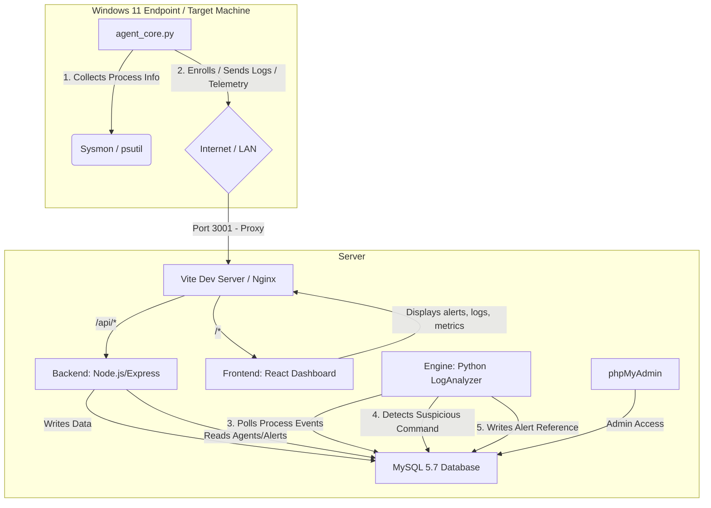

# LOTIflow (Sentinel Living off the Land Forensics) - Project Summary & Workflow

LOTIflow is an endpoint security and digital forensics platform designed specifically to detect, analyze, and manage **Living off the Land (LotL)** attacks. Living off the Land refers to a detection-evasion technique where attackers use legitimate, pre-installed system tools (like `PowerShell`, `certutil`, `WMI`, `bash`, `curl`) to perform malicious operations instead of uploading custom binaries.

---

## 1. System Architecture

The project follows a distributed client-server architecture:

### Components and Ports

| Service | Port | Technology | Purpose |
| :--- | :--- | :--- | :--- |
| **Frontend** | `3001` | React (Vite + TS) | Interactive dashboard displaying alerts, host logs, cases, and vulnerability metrics. |
| **Backend** | `5001` | Node.js (Express) | API server serving the agent enrollment, log ingestion, case management, and data routes. |
| **Database** | `3306` | MySQL 5.7 | Central database storing roles, logins, endpoints, logs, alerts, cases, and audit history. |
| **Engine** | — | Python 3 | Background log analyzer polling the database to execute detection rules and write alerts. |
| **phpMyAdmin** (optional) | `8083` | PHPMyAdmin | Web interface for database administrators. |
| **Windows Endpoint Agent** | Client | Python 3 / PowerShell | Monitored agent gathering system metrics and process event logs to submit to the backend API. |

---

## 2. Core Working Flow

The end-to-end telemetry and alert pipeline operates through the following steps:

### Phase 1: Endpoint Agent Enrollment
1. An administrator downloads the **Agent Bundle** (`LOTIflow_Agent_Installer.zip`) containing enrollment assets.
2. The agent executes `connect.py` (Validator) or `install.ps1`/`install.py` with the server URL (`http://<VM_IP>:8082`) and a shared enrollment secret (`MySecureProjectPassword2026!`).
3. The backend validates the secret and creates:
   - A host entry in `lotl_host` mapping the system details.
   - An agent entry in `lotl_agent` with a generated unique UUID and agent key.
4. The agent writes `agent_config.json` locally to store the authentication UUID.

### Phase 2: Telemetry & Ingestion
1. Every 10 seconds, `agent_core.py` gathers system utilization metrics (CPU, RAM, and Disk space) using `psutil`.
2. Concurrently, the agent retrieves a batch of running process details (name, executable path, parent context, command line, and user) and makes an HTTP POST request to `/api/logs` and `/api/telemetry`.
3. The Express backend receives the payload:
   - Updates `lotl_agent.last_seen` and `lotl_host.last_seen`.
   - Performs a transactional bulk insert of process entries into `lotl_process_event`.

### Phase 3: Forensic Detection & AI Analysis
1. The background analysis engine (`analyzer.py`) polls `lotl_process_event` table every 5 seconds for new `event_id` records higher than the last processed identifier.
2. The engine checks the commands against predefined signature rules:
   - **Rule 1: CertUtil Download**: Triggered if `certutil` is executed with arguments like `urlcache`, `split`, or `decode`.
   - **Rule 2: Suspicious PowerShell**: Triggered if `powershell`/`pwsh` is executed with `-enc` or `-encodedcommand`.
3. Upon detection, the engine generates a templated explanation using the rule's predefined template, MITRE ATT&CK technique ID, and the detected command.
4. The analysis is integrated with the detection rule severity and host indicators, and stored as a security alert in `soc_alert_reference`.

### Phase 4: Incident Response & Case Management
1. Security analysts view the triggered alerts on the React frontend Dashboard.
2. Analysts can acknowledge alerts (`/api/alerts/:id/ack`), grouping them into operational workflows.
3. Cases can be opened through the dashboard (`/api/cases`), linking specific security alerts (`lotl_case_alerts`) and including analyst-authored forensic notes (`lotl_case_note`).
4. Analysts can generate compliance reports or trigger actions such as endpoint isolation or mitigation status tracking.

---

## 3. Database Schema (`lotl_dfms`)

The system manages relationship states through the following tables:

* **`lotl_role`**: Contains access control definitions (e.g., `Admin`, `Analyst`, `Viewer`).
* **`lotl_login`**: Storage for user profiles, plain-text equivalent password hashes, and statuses.
* **`lotl_host`**: Registers monitored assets (e.g., `FIN-SRV-01`), their IP address, operating system, and environments (`lab`, `prod`).
* **`lotl_agent`**: Maps active connection UUIDs to host machines.
* **`lotl_user_host`**: Junction table mapping host ownership or permission constraints to analysts.
* **`lotl_detection_rule`**: Configurations for detection checks (Regex, keyword signatures, Sigma specifications).
* **`lotl_process_event`**: Live log storage for incoming Sysmon-style process creation events.
* **`lotl_alert_reference`**: Catalog of high-risk threat flags raised by the scanner, with AI analysis comments and resolution statuses (`new`, `open`, `suppressed`, `closed`).
* **`lotl_case`**: Tracks active forensic investigations, assignment ownership, and priority groups.
* **`lotl_case_alerts`**: Junction table relating specific threat alerts to opened cases.
* **`lotl_case_note`**: Logs timeline updates and text descriptions from investigators.
* **`lotl_acknowledgement`**: Captures analyst notes on alerts (marking them as false positives, ignored, etc.).
* **`lotl_forensic_artifact`**: Links collected file samples, scripts, or directories flagged as forensic evidence.
* **`lotl_audit_log`**: System log archiving administrative and analyst operations (logins, case creation, host adjustments).

---

## 4. Frontend Structure

The user interface is a dark-themed React application with a premium look, featuring glassmorphic panels and charts. It contains the following pages:

* **Login Pages (`/`, `/login/admin`, `/login/user`)**: Authenticates users based on roles (Admin vs. Standard Endpoint User).
* **Overview (`/overview`)**: Displays a dashboard of global event rates, active alerts, policy compliance metrics, a visual "risk grid" simulating geography, and top threat vectors.
* **Intelligence (`/intelligence`)**: Feeds active system alerts side-by-side with a detailed Command Inspector showing the command-line details and AI explanations. Allows toggle access to a Live Telemetry Event Stream.
* **Systems (`/systems`)**: Integrates tabs for managing active users, downloading endpoints agents, viewing registered hosts, editing detection rules, viewing system audits, and adjusting global application settings.
* **Cases (`/cases`)**: Handles full-cycle incident investigations, enabling analysts to view descriptions, timelines, link alerts, and add interactive notes to active cases.
* **Vulnerability Management (`/vulnerabilities`)**: Visualizes active CVE reports on monitored hosts (e.g., Critical RCEs) and tracks patch statuses.
* **Log Explorer (`/explorer`)**: An advanced query portal that filters logs by username, hostname, parent process, or keyword matches.
* **Threat Map (`/map`)**: Render of global threat concentrations across distinct operational hubs (e.g., Singapore, Tokyo, London, New York).
